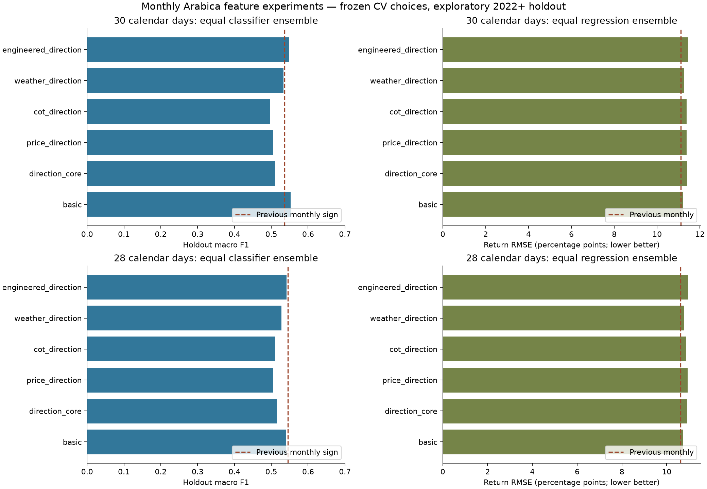
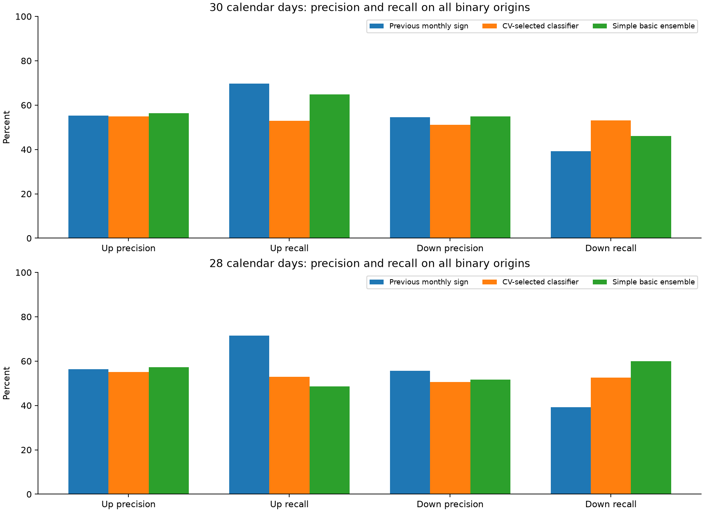

# Direction and return experiment results

Tested 72 feature/model/task configurations and 54 paper-family configurations at each of 30 and 28 calendar days: 252 horizon/configuration combinations, plus explicit equal-weight ensemble comparisons. Added 140 causal features. Direction thresholds and model choices use pre-2022 expanding validation; quarterly holdout fits use only matured labels.

The simple 30-day classifier ensemble improved point macro F1 and Down recall while losing some Up recall. The paper AR(63)/Ridge model also improved point direction. Neither is established as a reliable gain by dependence-aware intervals. The overall CV-selected classifiers worsened holdout performance, and the new return regressions did not beat the existing monthly return models. Keep the original return model as the reference; treat the direction alternatives as challengers for prospective evaluation.

| horizon_days | model | accuracy | macro_f1 | up_precision | up_recall | down_precision | down_recall |
|---|---|---|---|---|---|---|---|
| 30 | class__basic__equal_ensemble | 55.80% | 55.22% | 56.40% | 64.77% | 54.91% | 46.14% |
| 30 | reg__basic__equal_ensemble | 55.45% | 54.48% | 55.79% | 67.61% | 54.88% | 42.37% |
| 30 | selected_direction | 53.03% | 53.01% | 54.84% | 52.92% | 51.21% | 53.14% |
| 30 | selected_return | 55.10% | 53.70% | 55.28% | 69.95% | 54.77% | 39.14% |
| 30 | baseline_monthly_return | 55.02% | 53.63% | 55.22% | 69.78% | 54.64% | 39.14% |
| 30 | baseline_paper_return | 50.78% | 50.78% | 52.70% | 48.91% | 49.00% | 52.78% |
| 30 | baseline_majority | 48.18% | 32.52% | 0.00% | 0.00% | 48.18% | 100.00% |
| 28 | class__basic__equal_ensemble | 54.10% | 54.05% | 57.17% | 48.68% | 51.63% | 60.04% |
| 28 | reg__basic__equal_ensemble | 55.22% | 53.93% | 55.82% | 68.81% | 54.13% | 40.33% |
| 28 | selected_direction | 52.80% | 52.77% | 55.06% | 52.97% | 50.52% | 52.62% |
| 28 | selected_return | 54.79% | 53.02% | 55.27% | 70.96% | 53.81% | 37.07% |
| 28 | baseline_monthly_return | 56.08% | 54.50% | 56.31% | 71.45% | 55.64% | 39.24% |
| 28 | baseline_paper_return | 53.93% | 53.92% | 56.41% | 52.31% | 51.59% | 55.70% |
| 28 | baseline_majority | 47.71% | 32.30% | 0.00% | 0.00% | 47.71% | 100.00% |

Read the full reports for feature/model matrices, return error, optional uncertain-band coverage, nonoverlapping samples and confidence intervals:

- [30-day results](artifacts/direction/30calendar/report.md)
- [28-day results](artifacts/direction/28calendar/report.md)
- [Paper order/parameter search](docs/PAPER_PARAMETER_SEARCH.md)
- [Feature definitions](docs/FEATURE_ENGINEERING.md)
- [Validation and neural suitability](docs/VALIDATION.md)

All gains and losses are recorded; original MonthFu models remain available. This is a reused historical holdout, so improved metrics are exploratory. A direction advantage does not automatically imply better return error. Large deep networks were judged unsuitable for the effective monthly sample count; the controlled ELM search was run instead.
