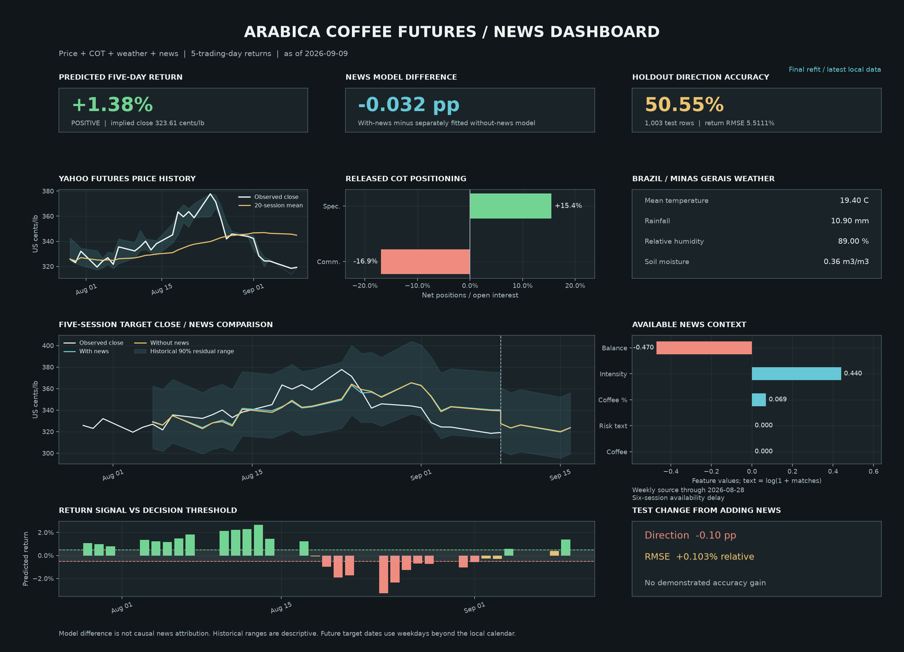

# Arabica Futures Research Workspace

Arabica Coffee Futures research workspace for building, evaluating, and running a 5-trading-day return model with Yahoo price data, COT positioning data, weather context, and optional GDELT/news event features.



## Start Here

- [`ResearchModelTrainingNews.ipynb`](ResearchModelTrainingNews.ipynb) - news-integrated companion with the same staged workflow, working prediction widgets, news impact tab, and saved dashboard.
- `ResearchModelTraining.ipynb` - original research-ensemble notebook, preserved unchanged.
- `data/centralData/arabica_ml_model_ready.csv` - prepared model-ready dataset used by the notebook.
- `Scripts/project/artifacts/models/research_paper_ensemble.joblib` - saved trained model bundle used for local prediction/dashboard output.
- `Scripts/project/` - reusable Python scripts, source modules, tests, requirements, generated models, outputs, and plots.
- `Scripts/notebooks/` - earlier/supporting notebooks.
- `Scripts/researchpapers/` - research paper references used to document the modeling approach.

## News-Integrated Model

The companion predicts five-trading-day Arabica Coffee C returns using 230 features: 31 from Yahoo price history, 46 from COT positioning, 144 from weather, and 9 from local news, including two text indicators. It reads the included daily/weekly summaries and does not require the missing large raw-event file or a cloud model.

| Paired model | Holdout direction accuracy | Five-day return RMSE |
| --- | ---: | ---: |
| Price + COT + weather | 50.65% | 5.5055% |
| Same model with news/text | 50.55% | 5.5111% |

These results cover the same 1,003 dates from 2022-09-07 through 2026-09-01. **News did not demonstrate an accuracy gain.** The earlier 61.35% result is withdrawn because it used future-price-derived scores. Corrected news features exclude those scores and wait six trading sessions because historical event selection also used subsequent returns. See [the full summary](Summary.MD) for limits and source audits.

The console has **Inputs**, **Latest Prediction**, **Dashboard**, **News Impact**, and **Context** tabs. It supports the all-input and no-news models, adjustable row counts and signal thresholds, and two distinct modes:

- **Latest refit:** estimates from the final model using the latest local data.
- **Holdout replay:** predictions from pre-test model weights, verified against the saved holdout CSV.

News impact is the difference between separately fitted models, not causal attribution. Future target dates beyond the stored calendar use weekday estimates. The notebook includes a static dashboard image for GitHub readers; live controls require Jupyter.

The original notebook ensemble is preserved. The all-input model is a separate experiment, not a replacement selected for better performance.

### Open The News Notebook

With the repository's virtual environment active and dependencies installed:

```bash
python -m notebook ResearchModelTrainingNews.ipynb
```

Run all cells. The default `RETRAIN = False` uses the saved bundle; set it to `True` to repeat local training. No data refresh is needed for this notebook.

To reproduce the executed notebook and its widget checks:

```bash
python Scripts/project/scripts/check_news_notebook.py
```

The automated check executes all 14 code cells, exercises all four view/model combinations, verifies holdout prediction equality, and checks that dashboard images are nonblank.

## Fresh GitHub Clone: Run Locally

These steps are for someone who only has the GitHub version of this repository.

1. Clone and enter the repo.

```bash
git clone https://github.com/TreavVasu/CoffeeFutures.git
cd CoffeeFutures
```

2. Create and activate a virtual environment.

```bash
python3 -m venv .venv
source .venv/bin/activate
```

3. Install the project dependencies.

```bash
pip install --upgrade pip
pip install -r Scripts/project/requirements.txt
```

4. Check or rebuild missing local data.

```bash
bash Scripts/fetch_missing_data.sh
```

This verifies the committed Yahoo/COT base file, refreshes weather if needed, forward-fills COT if needed, and rebuilds the prepared model dataset if it is missing.

On Windows, run the same command from Git Bash or WSL.

5. Start Jupyter.

```bash
python -m pip install notebook
jupyter notebook
```

6. Open and run:

```text
ResearchModelTrainingNews.ipynb
```

The news companion runs from the GitHub version using the committed prepared dataset, summaries and saved model bundle. The original `ResearchModelTraining.ipynb` remains available; its optional raw-event workflow requires the large local event file.

## One-Command Data Check

The helper script is the easiest way to repair a clone where derived data is missing:

```bash
bash Scripts/fetch_missing_data.sh
```

That script checks the committed base Yahoo/COT file, refreshes weather if needed, forward-fills COT data if needed, and rebuilds `data/centralData/arabica_ml_model_ready.csv` if needed.

Force all refresh/rebuild steps:

```bash
bash Scripts/fetch_missing_data.sh --force
```

To also regenerate the large ignored GDELT/news event file locally, run:

```bash
bash Scripts/fetch_missing_data.sh --with-events
```

The event rebuild can take a long time and creates large ignored files that should stay out of GitHub.

## What Is Included In GitHub

The GitHub version includes the files needed to open the main notebook and run the saved model/dashboard workflow:

- `ResearchModelTraining.ipynb`
- `ResearchModelTrainingNews.ipynb`, including executed outputs and saved widget state
- `Scripts/project/artifacts/models/arabica_all_inputs_news_model.joblib`
- `Scripts/project/artifacts/outputs/arabica_all_inputs_news_metrics.json`
- `Scripts/project/artifacts/outputs/arabica_all_inputs_news_holdout_predictions.csv`
- `Scripts/project/artifacts/outputs/gdelt_coffee_events_2000_2026_daily_summary.csv`
- `Scripts/project/artifacts/outputs/gdelt_coffee_events_2000_2026_weekly_summary.csv`
- `data/centralData/arabica_ml_model_ready.csv`
- `data/centralData/yahoo_cot_full_outer_by_date.csv`
- `data/centralData/yahoo_cot_full_outer_by_date_cot_ffill.csv`
- `data/weather/open_meteo_coffee_regions_daily.csv`
- `Scripts/project/artifacts/models/research_paper_ensemble.joblib`
- `Scripts/project/artifacts/outputs/research_paper_ensemble_metrics.json`
- `Scripts/project/artifacts/outputs/research_paper_model_comparison.csv`
- `Scripts/project/artifacts/outputs/research_paper_model_cv_summary.csv`
- `Scripts/project/artifacts/outputs/research_paper_model_holdout_predictions.csv`

## What Is Not Included

Large raw/generated event files are intentionally ignored because they exceed GitHub's file-size limits. This mainly affects full raw-data reproduction and event-enriched retraining.

The local `docs/` folder, environment files, browser/runtime files and plotting caches are excluded from GitHub.

Ignored examples:

- `data/events/gdelt_coffee_events_2000_2026_filtered_scored.csv`
- `data/events/gdelt_coffee_event_candidates_*_weekly_period_dump.csv`
- `Scripts/EventsData/Zip/*.zip`
- `Scripts/project/artifacts/outputs/gdelt_coffee_event_candidates_*.csv`

The notebook handles the missing local GDELT file by running without event features. The saved model and prepared model-ready data are still available for local prediction and dashboard generation.

## Optional: Refresh Or Rebuild Data

Run the full local check/rebuild wrapper:

```bash
bash Scripts/fetch_missing_data.sh
```

Refresh weather cache:

```bash
python Scripts/project/scripts/refresh_weather_cache.py --force-all
```

Forward-fill released COT data:

```bash
python Scripts/project/scripts/fill_cot_forward_daily.py
```

Rebuild the prepared model dataset from committed central data and weather cache:

```bash
python Scripts/project/scripts/prepare_ml_dataset.py
```

Retrain the research ensemble without the large local event file:

```bash
python Scripts/project/scripts/train_research_paper_ensemble.py --skip-events
```

Retrain with local GDELT/news event features only after regenerating or restoring the ignored event file locally:

```bash
python Scripts/project/scripts/train_research_paper_ensemble.py
```

## Latest Dashboard Artifacts

- `Scripts/project/artifacts/plots/latest_arabica_news_prediction_console.png`
- `Scripts/project/artifacts/outputs/latest_arabica_news_console_predictions.csv`
- `Scripts/project/artifacts/plots/arabica_all_inputs_news_evaluation.png`
- `Scripts/project/artifacts/outputs/news_notebook_execution_check.json`
- `Scripts/project/artifacts/outputs/latest_research_paper_return_predictions.csv`
- `Scripts/project/artifacts/plots/latest_research_paper_return_prediction_console.png`

## Notes

- The model target is a 5-trading-day forward Arabica futures return.
- Positive/negative indications are based on the notebook's decision threshold.
- The shaded forecast range in the dashboard is empirical model error from holdout residuals, not a guarantee.
- To fully reproduce the original event-enriched raw pipeline, regenerate the ignored GDELT/news data locally before retraining with events enabled.
